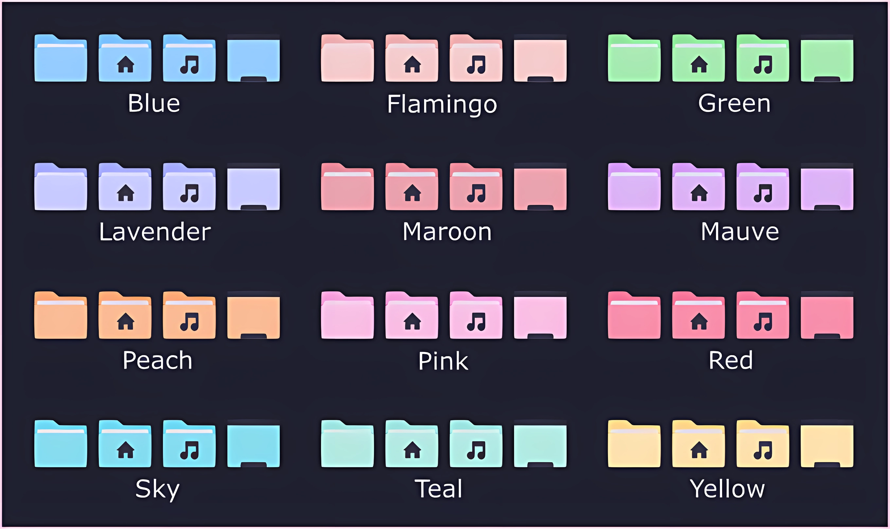
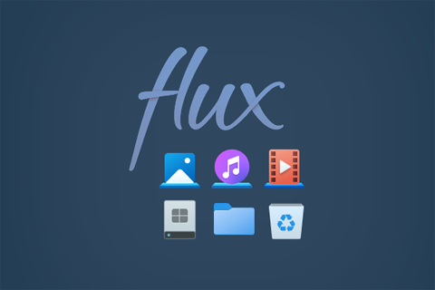
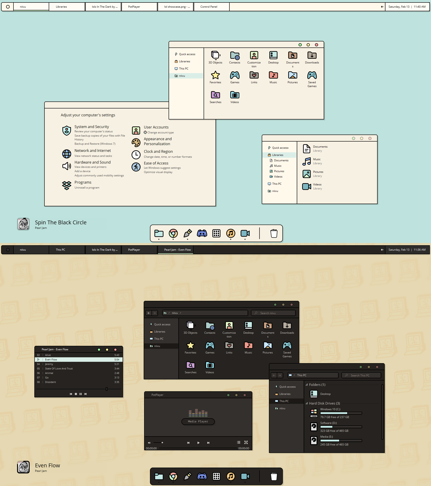
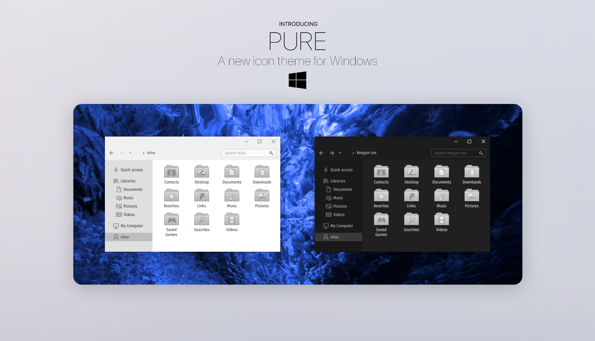
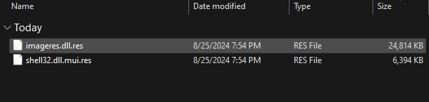
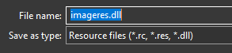

# Resource Redirect icon themes

A collection of icon theme packs for Windhawk's Resource Redirect mod.

## Table of contents

* [Introduction](#introduction)
* [Installation](#installation)
* [Contributing](#contributing)
* [Credits](#credits)
* [Themes](#themes)
* [Converting 7TSP Themes](#converting-7tsp-themes)

## Introduction

This is a collection of commonly requested open source and community contributed icon theme packs which are intended
to work with Windhawk's [Resource Redirect](https://windhawk.net/mods/icon-resource-redirect) mod.

> [!NOTE]
> Resource Redirect mod works also with other types of resources listed [here](https://windhawk.net/mods/icon-resource-redirect).

## Installation
If you're not familiar with Windhawk, here are the steps for installing the mod:

* Download Windhawk from [windhawk.net](https://windhawk.net/) and install it.
* Go to "Mods" in the upper right menu.
* Find and install the "Resource Redirect" mod.

### Theme Installation

* Download your theme of preference through the [theme folder](https://github.com/niivu/resource-redirect-icon-themes/tree/main/Resource%20Redirect%20themes).
* Unzip and extract the theme folder in a directory of your system.
* Copy the path of the theme folder (right click - copy as path) which contains the theme files.
* Open Windhawk, go to the already installed "Resource Redirect" mod.
* Go to mod's settings tab.
* Paste the copied path to the theme folder empty box and remove the path quote marks.
* Click Save.
* You might want to disable folder thumbnail previews and clear icon cache, see notes below.

> [!TIP]
> For a cleaner look, use [the script to disable folder thumbnail previews](https://github.com/niivu/resource-redirect-icon-themes/blob/main/Scripts/Disable_folder_thumbnail_previews.bat).

> [!NOTE]
> After applying the theme, you may not see immediate results due to Windows icon caching. You can use [the script to clear icon cache](https://github.com/niivu/resource-redirect-icon-themes/blob/main/Scripts/Clear_icon_cache.bat).

> [!CAUTION]
> Don't move the theme files or change their filenames unless you know how the theme redirection works!

### Installation Demo

*Click on the image to view the demo video on YouTube.*

## Contributing

If you have a theme pack that you would
like to share, please submit a [pull request](https://github.com/niivu/resource-redirect-icon-themes/pulls).

### Issues
If you are experiencing issues with this mod, please [open an issue](https://github.com/niivu/resource-redirect-icon-themes/issues).

## Credits
- [@ramensoftware](https://github.com/ramensoftware/): Windhawk
- [@niivu](https://github.com/niivu): The [7tsp Icon Themes Repository](https://github.com/niivu/7tsp-Icon-themes) holding most of the shared icon packs.
 
If you like my icon packs please follow and support [my work](https://www.deviantart.com/niivu).

## Themes

> [!TIP]
> You can use a theme pack with other single resource files.

<table>
<tr>
<th>Links</th>
<th width="500px">Previews</th>
</tr>
<tr>
<td>
<a href="Resource Redirect themes/All White Icons.zip">All White Icons</a>
</td>
<td>

</td>
</tr>
<tr>
<td>
<a href="Resource Redirect themes/antu alt.zip">Antu alt</a>
</td>
<td rowspan="4">

</td>
</tr>
<tr>
<td>
<a href="Resource Redirect themes/antu.zip">Antu</a>
</td>
</tr>
<tr>
<td>
<a href="Resource Redirect themes/kuyen alt.zip">Kuyen Alt</a>
</td>
</tr>
<tr>
<td>
<a href="Resource Redirect themes/kuyen.zip">Kuyen</a>
</td>
</tr>
<tr>
<td>
<a href="Resource Redirect themes/ARC Symbolic.zip">ARC Symbolic</a>
</td>
<td rowspan="2">

</td>
</tr>
<tr>
<td>
<a href="Resource Redirect themes/ARC.zip">ARC</a>
</td>
</tr>
<tr>
<td>
<a href="Resource Redirect themes/arc-neutral brown.zip">Arc Neutral Brown</a>
</td>
<td rowspan="2">

</td>
</tr>
<tr>
<td>
<a href="Resource Redirect themes/arc-neutral grey.zip">Arc Neutral Grey</a>
</td>
</tr>
<tr>
<td>
<a href="Resource Redirect themes/BANAANA OneUI.zip">BananaOneUI</a>
</td>
<td>

</td>
</tr>
<tr>
<td>
<a href="Resource Redirect themes/Big Sur DarkMode.zip">Big Sur DarkMode</a>
</td>
<td rowspan="2">

</td>
</tr>
<tr>
<td>
<a href="Resource Redirect themes/Big Sur LightMode.zip">Big Sur LightMode</a>
</td>
</tr>
<tr>
<td>
<a href="Resource Redirect themes/blanked dark mode.zip">Blanked DarkMode</a>
</td>
<td rowspan="2">

</td>
</tr>
<tr>
<td>
<a href="Resource Redirect themes/blanked light mode.zip">Blanked LightMode</a>
</td>
</tr>
<tr>
<td>
<a href="Resource Redirect themes/bonny by niivu.zip">Bonny</a>
</td>
<td>

</td>
</tr>
<tr>
<td>
<a href="Resource Redirect themes/bouquet.zip">Bouquet</a>
</td>
<td>

</td>
</tr>
<tr>
<td>
<a href="Resource Redirect themes/buuf.zip">Buuf</a>
</td>
<td>

</td>
</tr>
<tr>
<td>
<a href="Resource Redirect themes/cakeOS 2.0.zip">CakeOS 2.0</a>
</td>
<td rowspan="6">

</td>
</tr>
<tr>
<td>
<a href="Resource Redirect themes/Cake OS Blue.zip">CakeOS Blue</a>
</td>
</tr>
<tr>
<td>
<a href="Resource Redirect themes/Cake OS Green.zip">CakeOS Green</a>
</td>
</tr>
<tr>
<td>
<a href="Resource Redirect themes/Cake OS Orange.zip">CakeOS Orange</a>
</td>
</tr>
<tr>
<td>
<a href="Resource Redirect themes/Cake OS Purple.zip">CakeOS Purple</a>
</td>
</tr>
<tr>
<td>
<a href="Resource Redirect themes/Cake OS Red.zip">CakeOS Red</a>
</td>
</tr>
<tr>
<td>
<a href="Resource Redirect themes/candy original folders.zip">Candy Original</a>
</td>
<td rowspan="2">

</td>
</tr>
<tr>
<td>
<a href="Resource Redirect themes/candy outlined folders.zip">Candy Outlined</a>
</td>
</tr>
<tr>
<td>
<a href="Resource Redirect themes/Catppuccin.zip">Catppuccin</a>
</td>
<td rowspan="15">

</td>
</tr>
<tr>
<td>
<a href="Resource Redirect themes/Catppuccin blue.zip">Catppuccin Blue</a>
</td>
</tr>
<tr>
<td>
<a href="Resource Redirect themes/Catppuccin flamingo.zip">Catppuccin Flamingo</a>
</td>
</tr>
<tr>
<td>
<a href="Resource Redirect themes/Catppuccin green.zip">Catppuccin Green</a>
</td>
</tr>
<tr>
<td>
<a href="Resource Redirect themes/Catppuccin Latte.zip">Catppuccin Latte</a>
</td>
</tr>
<tr>
<td>
<a href="Resource Redirect themes/Catppuccin lavender.zip">Catppuccin Lavender</a>
</td>
</tr>
<tr>
<td>
<a href="Resource Redirect themes/Catppuccin maroon.zip">Catppuccin Maroon</a>
</td>
</tr>
<td>
<a href="Resource Redirect themes/Catppuccin mauve.zip">Catppuccin Mauve</a>
</td>
<tr>
<td>
<a href="Resource Redirect themes/Catppuccin Mocha.zip">Catppuccin Mocha</a>
</td>
</tr>
<tr>
<td>
<a href="Resource Redirect themes/Catppuccin peach.zip">Catppuccin Peach</a>
</td>
</tr>
<tr>
<td>
<a href="Resource Redirect themes/Catppuccin pink.zip">Catppuccin Pink</a>
</td>
</tr>
<tr>
<td>
<a href="Resource Redirect themes/Catppuccin red.zip">Catppuccin Red</a>
</td>
</tr>
<tr>
<td>
<a href="Resource Redirect themes/Catppuccin sky.zip">Catppuccin Sky</a>
</td>
</tr>
<tr>
<td>
<a href="Resource Redirect themes/Catppuccin teal.zip">Catppuccin Teal</a>
</td>
</tr>
<tr>
<td>
<a href="Resource Redirect themes/Catppuccin yellow.zip">Catppuccin Yellow</a>
</td>
</tr>
<tr>
<td>
<a href="Resource Redirect themes/Deepin Blue - for dark themes.zip">Deepin Blue DarkMode</a>
</td>
<td rowspan="8">

</td>
</tr>
<tr>
<td>
<a href="Resource Redirect themes/Deepin Blue - for light themes.zip">Deepin Blue LightMode</a>
</td>
</tr>
<tr>
<td>
<a href="Resource Redirect themes/Deepin Brown - for dark themes.zip">Deepin Brown DarkMode</a>
</td>
</tr>
<tr>
<td>
<a href="Resource Redirect themes/Deepin Brown - for light themes.zip">Deepin Brown LightMode</a>
</td>
</tr>
<tr>
<td>
<a href="Resource Redirect themes/Deepin Green - for dark themes.zip">Deepin Green DarkMode</a>
</td>
</tr>
<tr>
<td>
<a href="Resource Redirect themes/Deepin Green - for light themes.zip">Deepin Green LightMode</a>
</td>
</tr>
<tr>
<td>
<a href="Resource Redirect themes/Deepin Slate - for dark themes.zip">Deepin Slate DarkMode</a>
</td>
</tr>
<tr>
<td>
<a href="Resource Redirect themes/Deepin Slate - for light themes.zip">Deepin Slate LightMode</a>
</td>
</tr>
<tr>
<td>
<a href="Resource Redirect themes/Deepo Icon pack.zip">Deepo</a>
<td>

</td>
<tr>
<td>
<a href="Resource Redirect themes/Tango.zip">Tango</a>
</td>
<td rowspan="12">

</td>
</tr>
<tr>
<td>
<a href="Resource Redirect themes/Tangerine.zip">Tangerine</a>
</td>
</tr>
<tr>
<td>
<a href="Resource Redirect themes/Gnome.zip">Gnome</a>
</td>
</tr>
<tr>
<td>
<a href="Resource Redirect themes/Cheser.zip">Cheser</a>
</td>
</tr>
<tr>
<td>
<a href="Resource Redirect themes/Gnome Brave.zip">Gnome Brave</a>
</td>
</tr>
<tr>
<td>
<a href="Resource Redirect themes/Gnome Human.zip">Gnome Human</a>
</td>
</tr>
<tr>
<td>
<a href="Resource Redirect themes/Gnome Noble.zip">Gnome Noble</a>
</td>
</tr>
<tr>
<td>
<a href="Resource Redirect themes/Gnome Wine.zip">Gnome Wine</a>
</td>
</tr>
<tr>
<td>
<a href="Resource Redirect themes/Gnome Wise.zip">Gnome Wise</a>
</td>
</tr>
<tr>
<td>
<a href="Resource Redirect themes/Elementary.zip">Elementary</a>
</td>
</tr>
<tr>
<td>
<a href="Resource Redirect themes/Elementary NEW.zip">Elementary New</a>
</td>
</tr>
<tr>
<td>
<a href="Resource Redirect themes/Humanity.zip">Humanity</a>
</td>
</tr>
<tr>
<td>
<a href="Resource Redirect themes/Everblush.zip">Everblush</a>
</td>
<td>

</td>
</tr>
<tr>
<td>
<a href="Resource Redirect themes/everforest.zip">Everforest</a>
</td>
<td align=center rowspan="2">

</td>
</tr>
<tr>
<td>
<a href="Resource Redirect themes/everforest blank.zip">Everforest Blank</a>
</td>
</tr>
<tr>
<td>
<a href="Resource Redirect themes/Eyecandy.zip">Eyecandy</a>
</td>
<td>

</td>
</tr>
<tr>
<td>
<a href="Resource Redirect themes/FABA.zip">Faba</a>
</td>
<td rowspan="4">

</td>
</tr>
<tr>
<td>
<a href="Resource Redirect themes/FABA Symbolic.zip">Faba Symbolic</a>
</td>
</tr>
<tr>
<td>
<a href="Resource Redirect themes/SLATE.zip">Slate</a>
</td>
</tr>
<tr>
<td>
<a href="Resource Redirect themes/SLATE Symbolic.zip">Slate Symbolic</a>
</td>
</tr>
<tr>
<td>
<a href="Resource Redirect themes/Fetch.zip">Fetch</a>
</td>
<td>

</td>
</tr>
<tr>
<td>
<a href="Resource Redirect themes/Fluent.zip">Fluent</a>
</td>
<td rowspan="3">

</td>
</tr>
<tr>
<td>
<a href="Resource Redirect themes/Fluent Keys Night.zip">Fluent Keys Night</a>
</td>
</tr>
<tr>
<td>
<a href="Resource Redirect themes/Fluent Keys Day.zip">Fluent Keys Day</a>
</td>
</tr>
<tr>
<td>
<a href="Resource Redirect themes/FLURRY.zip">Flurry</a>
</td>
<td>

</td>
</tr>
<tr>
<td>
<a href="Resource Redirect themes/FLUX.7z">Flux</a>
</td>
<td>

</td>
</tr>
<tr>
<td>
<a href="Resource Redirect themes/Gruvbox.zip">Gruvbox</a>
</td>
<td rowspan=3>

</td>
</tr>
<tr>
<td>
<a href="Resource Redirect themes/gruvbox plus - Olive.zip">Gruvbox Plus Olive</a>
</td>
</tr>
<tr>
<td>
<a href="Resource Redirect themes/Gruvbox numix.zip">Gruvbox Numix</a>
</td>
</tr>
<tr>
<td>
<a href="Resource Redirect themes/Haiku BeOS.zip">Haiku BeOS</a>
</td>
<td>

</td>
</tr>
<tr>
<td>
<a href="Resource Redirect themes/janguru blue.zip">Janguru Blue</a>
</td>
<td rowspan=6>

</td>
</tr>
<tr>
<td>
<a href="Resource Redirect themes/janguru bluegrey.zip">Janguru BlueGrey</a>
</td>
</tr>
<tr>
<td>
<a href="Resource Redirect themes/janguru brown.zip">Janguru Brown</a>
</td>
</tr>
<tr>
<td>
<a href="Resource Redirect themes/janguru green.zip">Janguru Green</a>
</td>
</tr>
<tr>
<td>
<a href="Resource Redirect themes/janguru grey.zip">Janguru Grey</a>
</td>
</tr>
<tr>
<td>
<a href="Resource Redirect themes/janguru orange.zip">Janguru Orange</a>
</td>
</tr>
<tr>
<td>
<a href="Resource Redirect themes/koZ.zip">koZ</a>
</td>
<td>

</td>
</tr>
<tr>
<td>
<a href="Resource Redirect themes/Linuxfx-11-AIO.zip">Linuxfx 11 AIO</a>
</td>
<td rowspan=2>

</td>
</tr>
<tr>
<td>
<a href="Resource Redirect themes/Linuxfx-11-lite.zip">Linuxfx 11 Lite</a>
</td>
</tr>
<tr>
<td>
<a href="Resource Redirect themes/lol.zip">Lol</a>
</td>
<td>

</td>
</tr>
<tr>
<td>
<a href="Resource Redirect themes/Lumicons Folders.zip">Lumicons Folders</a>
</td>
<td rowspan=2>

</td>
</tr>
<tr>
<td>
<a href="Resource Redirect themes/Lumicons Symbols.zip">Lumicons Symbols</a>
</td>
</tr>
<tr>
<td>
<a href="Resource Redirect themes/mac osx.zip">macOSx</a>
</td>
<td>

</td>
</tr>
<tr>
<td>
<a href="Resource Redirect themes/macOS Regular.zip">macOS Regular</a>
</td>
<td rowspan=5>

</td>
</tr>
<tr>
<td>
<a href="Resource Redirect themes/macOS blue.zip">macOS Blue</a>
</td>
</tr>
<tr>
<td>
<a href="Resource Redirect themes/macOS Yellow Folders.zip">macOS Yellow</a>
</td>
</tr>
<tr>
<td>
<a href="Resource Redirect themes/macOS Dark Mode.zip">macOS DarkMode</a>
</td>
</tr>
<tr>
<td>
<a href="Resource Redirect themes/macOS Light Mode.zip">macOS LightMode</a>
</td>
</tr>
<tr>
<td>
<a href="Resource Redirect themes/macpac darkmode.zip">macPac DarkMode</a>
</td>
<td rowspan=2>

</td>
</tr>
<tr>
<td>
<a href="Resource Redirect themes/macpac lightmode.zip">macPac LightMode</a>
</td>
</tr>
<tr>
<td>
<a href="Resource Redirect themes/mechanical.zip">Mechanical</a>
</td>
<td>

</td>
</tr>
<tr>
<td>
<a href="Resource Redirect themes/MINIUM2.zip">Minium2</a>
</td>
<td>

</td>
</tr>
<tr>
<td>
<a href="Resource Redirect themes/Nord Papirus.zip">Nord Papirus</a>
</td>
<td rowspan=2>

</td>
</tr>
<tr>
<td>
<a href="Resource Redirect themes/Nord-Papirus-Nova-galactic.zip">Nord Papirus NovaGalactic</a>
</td>
</tr>
<tr>
<td>
<a href="Resource Redirect themes/numix.zip">Numix</a>
</td>
<td rowspan=6>

</td>
</tr>
<tr>
<td>
<a href="Resource Redirect themes/numix-remix-blue.zip">Numix Blue</a>
</td>
</tr>
<tr>
<td>
<a href="Resource Redirect themes/numix-remix-green.zip">Numix Green</a>
</td>
</tr>
<tr>
<td>
<a href="Resource Redirect themes/numix-remix-macos.zip">Numix macOS</a>
</td>
</tr>
<tr>
<td>
<a href="Resource Redirect themes/numix-remix-slate.zip">Numix Slate</a>
</td>
</tr>
<tr>
<td>
<a href="Resource Redirect themes/numix-remix-windows.zip">Numix Windows</a>
</td>
</tr>
<tr>
<td>
<a href="Resource Redirect themes/NUX.zip">NUX</a>
</td>
<td>

</td>
</tr>
<tr>
<td>
<a href="Resource Redirect themes/One Dark Pro.zip">One Dark Pro</a>
</td>
<td rowspan=2>

</td>
</tr>
<tr>
<td>
<a href="Resource Redirect themes/One Dark Pro alt.zip">One Dark Pro Alt</a>
</td>
</tr>
<tr>
<td>
<a href="Resource Redirect themes/OneUI4.zip">One UI4</a>
</td>
<td>

</td>
</tr>
<tr>
<td>
<a href="Resource Redirect themes/OS X Minimalism.zip">OS X Minimalism</a>
</td>
<td rowspan=2>

</td>
</tr>
<tr>
<td>
<a href="Resource Redirect themes/OS X Minimalism Symbolic.zip">OS X Minimalism Symbolic</a>
</td>
</tr>
<tr>
<td>
<a href="Resource Redirect themes/Paper.zip">Paper</a>
</td>
<td>

</td>
</tr>
<tr>
<td>
<a href="Resource Redirect themes/Papirus Black.zip">Papirus Black</a>
</td>
<td rowspan=16>

</td>
</tr>
<tr>
<td>
<a href="Resource Redirect themes/Papirus Blue Grey.zip">Papirus BlueGrey</a>
</td>
</tr>
<tr>
<td>
<a href="Resource Redirect themes/Papirus Blue.zip">Papirus Blue</a>
</td>
</tr>
<tr>
<td>
<a href="Resource Redirect themes/Papirus Brown.zip">Papirus Brown</a>
</td>
</tr>
<tr>
<td>
<a href="Resource Redirect themes/Papirus Deep Orange.zip">Papirus Deep Orange</a>
</td>
</tr>
<tr>
<td>
<a href="Resource Redirect themes/Papirus Dracula.zip">Papirus Dracula</a>
</td>
</tr>
<tr>
<td>
<a href="Resource Redirect themes/Papirus Grey.zip">Papirus Grey</a>
</td>
</tr>
<tr>
<td>
<a href="Resource Redirect themes/Papirus Magenta.zip">Papirus Magenta</a>
</td>
</tr>
<tr>
<td>
<a href="Resource Redirect themes/Papirus Pink.zip">Papirus Pink</a>
</td>
</tr>
<tr>
<td>
<a href="Resource Redirect themes/Papirus Red.zip">Papirus Red</a>
</td>
</tr>
<tr>
<td>
<a href="Resource Redirect themes/Papirus Solarized.zip">Papirus Solarized</a>
</td>
</tr>
<tr>
<td>
<a href="Resource Redirect themes/Papirus Teal.zip">Papirus Teal</a>
</td>
</tr>
<tr>
<td>
<a href="Resource Redirect themes/Papirus Violet.zip">Papirus Violet</a>
</td>
</tr>
<tr>
<td>
<a href="Resource Redirect themes/Tokyo Night blank.zip">Tokyo Night</a>
</td>
</tr>
<tr>
<td>
<a href="Resource Redirect themes/Tokyo Night Papirus.zip">Tokyo Night Papirus</a>
</td>
</tr>
<tr>
<td>
<a href="Resource Redirect themes/Tokyo Night SE Papirus.zip">Tokyo Night SE Papirus</a>
</td>
</tr>

<tr>
<td>
<a href="Resource Redirect themes/pink folders.zip">Pink Folders</a>
</td>
<td>

</td>
</tr>
<tr>
<td>
<a href="Resource Redirect themes/post.zip">Post</a>
</td>
<td>

</td>
</tr>
<tr>
<td>
<a href="Resource Redirect themes/Pure for dark or dark side panel themes.zip">Pure Dark</a>
</td>
<td rowspan=2>

</td>
</tr>
<tr>
<td>
<a href="Resource Redirect themes/Pure for light themes.zip">Pure Light</a>
</td>
</tr>
<tr>
<td>
<a href="Resource Redirect themes/Quixotic-SE Day AIO.zip">Quixotic Day</a>
</td>
<td rowspan=3>

</td>
</tr>
<tr>
<td>
<a href="Resource Redirect themes/Quixotic-SE Dark AIO.zip">Quixotic Dark</a>
</td>
</tr>
<tr>
<td>
<a href="Resource Redirect themes/Quixotic-SE Night AIO.zip">Quixotic Night</a>
</td>
</tr>
<tr>
<td>
<a href="Resource Redirect themes/Rose Pine.zip">Rose Pine</a>
</td>
<td>

</td>
</tr>
<tr>
<td>
<a href="Resource Redirect themes/solarized Day AIO.zip">Solarized Day AIO</a>
</td>
<td rowspan=2>

</td>
</tr>
<tr>
<td>
<a href="Resource Redirect themes/solarized Night AIO.zip">Solarized Night AIO</a>
</td>
</td>
</tr>
<tr>
<td>
<a href="Resource Redirect themes/Solus.zip">Solus</a>
</td>
<td>

</td>
</tr>
<tr>
<td>
<a href="Resource Redirect themes/Somatic Rebirth.zip">Somatic Rebirth</a>
</td>
<td>

</td>
</tr>
<tr>
<td>
<a href="Resource Redirect themes/space-shrooms-blue.zip">Spaceshrooms Blue</a>
</td>
<td rowspan=3>

</td>
</tr>
<tr>
<td>
<a href="Resource Redirect themes/space-shrooms-green.zip">Spaceshrooms Green</a>
</td>
</tr>
<tr>
<td>
<a href="Resource Redirect themes/space-shrooms-yellow.zip">Spaceshrooms Yellow</a>
</td>
</tr>
<tr>
<td>
<a href="Resource Redirect themes/Super Remix Blue.zip">Super Remix Blue</a>
</td>
<td rowspan=3>

</td>
</tr>
<tr>
<td>
<a href="Resource Redirect themes/Super Remix Green.zip">Super Remix Green</a>
</td>
</tr>
<tr>
<td>
<a href="Resource Redirect themes/Super Remix Slate.zip">Super Remix Slate</a>
</td>
</tr>
<tr>
<td>
<a href="Resource Redirect themes/Sweet Awesomeness.zip">Sweet Awesomeness</a>
</td>
<td rowspan=6>

</td>
</tr>
<tr>
<td>
<a href="Resource Redirect themes/Sweetness Blue folders.zip">Sweetness Blue</a>
</td>
</tr>
<tr>
<td>
<a href="Resource Redirect themes/Sweetness Neutral.zip">Sweetness Neutral</a>
</td>
</tr>
<tr>
<td>
<a href="Resource Redirect themes/Sweetness Original.zip">Sweetness Original</a>
</td>
</tr>
<tr>
<td>
<a href="Resource Redirect themes/Sweetness Pink folders.zip">Sweetness Pink</a>
</td>
</tr>
<tr>
<td>
<a href="Resource Redirect themes/Sweetness Purple folders.zip">Sweetness Purple</a>
</td>
</tr>
<tr>
<td>
<a href="Resource Redirect themes/Sweet-Rainbow.zip">Sweet Rainbow</a>
</td>
<td>

</td>
</tr>
<tr>
<td>
<a href="Resource Redirect themes/Uos Icon pack.zip">UOS</a>
</td>
<td>

</td>
</tr>
<tr>
<td>
<a href="Resource Redirect themes/Windows 11 New (default).zip">Windows 11 New (default)</a>
</td>
<td rowspan=6>

</td>
</tr>
<tr>
<td>
<a href="Resource Redirect themes/Windows 11 New Folders Blue.zip">Windows 11 New Folders Blue</a>
</td>
</tr>
<tr>
<td>
<a href="Resource Redirect themes/Windows 11 New Folders Green.zip">Windows 11 New Folders Green</a>
</td>
</tr>
<tr>
<td>
<a href="Resource Redirect themes/Windows 11 New Folders Purple.zip">Windows 11 New Folders Purple</a>
</td>
</tr>
<tr>
<td>
<a href="Resource Redirect themes/Windows 11 New Folders Slate.zip">Windows 11 New Folders Slate</a>
</td>
</tr>
<tr>
<td>
<a href="Resource Redirect themes/Windows 11 New Folders Yellow.zip">Windows 11 New Folders Yellow</a>
</td>
</tr>
</table>

## Converting 7TSP Themes

Icon themes made for 7TSP use file types that Resource Redirect cannot read. Therefore, they have to be converted using a tool like [Resource Hacker](https://www.angusj.com/resourcehacker/).
1. Download Resource Hacker if you have not already, you can use the portable version if you don't want to fully install.
2. Find the folder of your 7TSP theme with files ending in `.res`.

3. Pick a file you want to convert and either drag it into a running Resource Hacker window or open it from the `File` menu.
4. Press the green `Save As` button in the top bar.

5. In the `Save As` box, remove the `.res` extension from the file and replace any other extensions with `.dll`.

6. The file should now be readable by Resource Redirect, you can now continue with the normal icon theme making steps!
